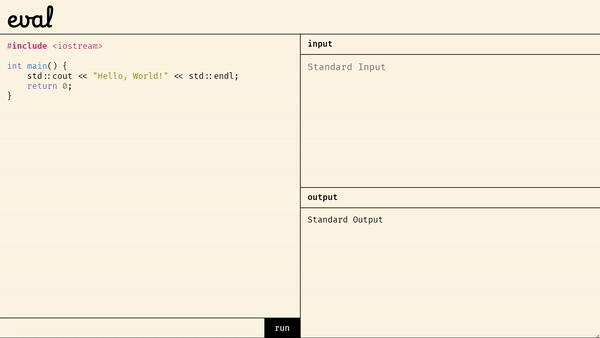
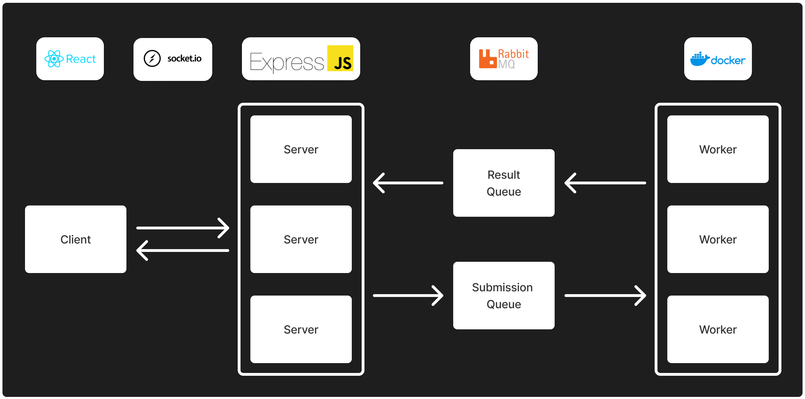

# eval

An online compiler to **eval**uate C++ code.

What inspired me to build this project was a [Codeforces clone](https://github.com/nubskr/codespace) I stumbled upon a while ago and some readings I did regarding message queues in system design. Overall, I had a lot of fun building this project and learned more about how to build a scalable system.

## Demo

    

## Architecture

    

 

The most notable part of the architecture for this project is the use of message queues between the servers and the workers. When submissions are received by the servers, they enqueue the submissions to the submission queue. The workers then pick up the submissions from the queue and execute them. Similarly, when the submissions are evaluated, the workers enqueue the results to the result queue. The servers pick up these results from the queue and return them to the clients. The message queue increases the scalability of the system by allowing the workers and the servers to scale independently. It also enables them to process messages at their own pace, as the queue is non-blocking.

To execute untrusted code, each worker runs the code on a Docker container without network access. While this may not be the safest way to execute untrusted code, it is not the main focus of this project.

Communication between the servers and the clients is done via WebSockets.

## Local Development

To launch the application, it is necessary to have [Node.js](http://nodejs.org/), [npm](https://npmjs.com/), and [Docker](https://www.docker.com/) installed on your system.

1. Clone this repository and navigate to it.

`$ git clone https://github.com/wyhong3103/eval.git`

2. Navigate to `/frontend`, `/backend`, `/worker` and install the necessary packages.

`$ npm i`

3. Run the docker container.

`$ docker-compose -f ./docker-compose.yaml up`

4. Navigate to `/backend` and `/worker` and launch the services.

`$ npm run dev`

5. Navigate to `/frontend` and launch the web application.

`$ npm run start`

> TODO: Containerize each of the services and put them into docker-compose.
